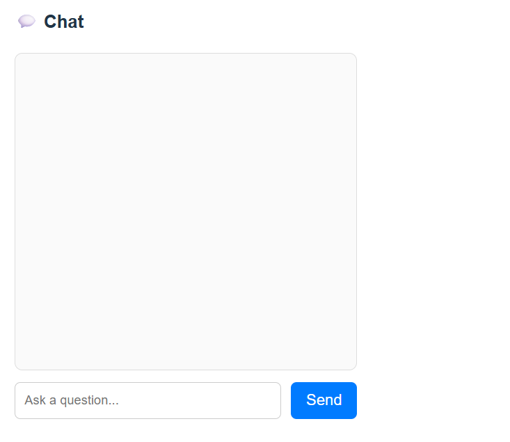

# rem.ai — Retrieval-Augmented AI Chatbot

rem.ai is a full-stack AI chatbot that allows users to upload documents (PDF/TXT) and ask context-aware questions.  
The system uses a Retrieval-Augmented Generation (RAG) pipeline to ensure answers are grounded in the uploaded documents.

---

## 🚀 Features

- 📄 Upload PDF or text documents
- ✂️ Automatic text parsing and chunking
- 🧠 Semantic search using vector embeddings
- 📦 FAISS vector database for fast retrieval
- 🤖 Local LLM (LLaMA 3 via Ollama) for response generation
- 💬 Modern chat UI with auto-scroll and markdown-rendered responses
- ⚡ React + Vite frontend with FastAPI backend

---

## 🧠 How It Works (RAG Pipeline)

1. User uploads a document
2. Document text is extracted and split into chunks
3. Each chunk is converted into vector embeddings
4. Embeddings are stored in a FAISS vector index
5. User asks a question
6. The question is embedded and matched with relevant document chunks
7. Retrieved context is passed to a local LLM to generate a grounded response

---

## 🛠 Tech Stack

### Backend
- Python
- FastAPI
- FAISS
- Sentence Transformers
- Ollama (LLaMA 3)

### Frontend
- React
- Vite
- JavaScript
- CSS

---

## ⚙️ Setup Instructions

### Prerequisites
- Python 3.9+
- Node.js (LTS)
- Ollama installed locally

---

### Backend Setup

```bash
cd backend
pip install -r requirements.txt
uvicorn main:app --reload

**## 📸 Screenshots

### Upload Interface


### Chat Interface

